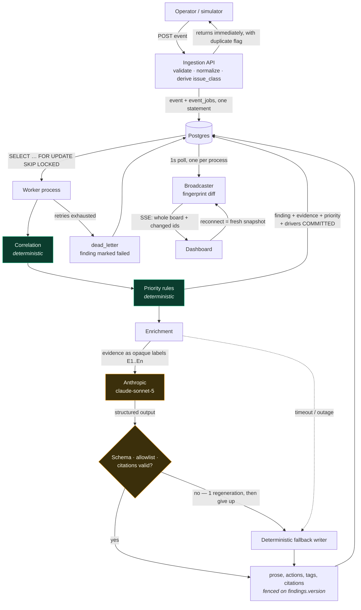

# Sauce Ops Copilot

Real-time restaurant operations copilot: ingests operational events, correlates them
into findings, and surfaces AI-generated summaries and recommended actions on a live
dashboard.

> **Note to self — delete this block before submitting.**
> Each section below is tagged `<!-- OWNER: agent | slice: N -->` or
> `<!-- OWNER: design-chat -->`. The agent fills its sections during the slice-done ritual.
> Human-owned sections are judgment calls and must be written by me, in my own voice.
> A section still containing `_TODO_` at submission time is a bug.

---

## Quick start
<!-- OWNER: agent | slice: 10 (docker) -->

_TODO_

```bash
# target: one command, no manual configuration
docker compose up
```

Then open http://localhost:3000

**Without an API key:** the system runs end-to-end using the deterministic fallback
LLM provider. **With a key:** set `ANTHROPIC_API_KEY` and `LLM_PROVIDER=anthropic`
in `.env` for real model-generated summaries.

---

## What this does
<!-- OWNER: agent | slice: 6 (once the UI exists and the loop is visible) -->

A restaurant operator gets a stream of individual operational events — a late delivery, a
complaint, a refund, a one-star review — and no way to tell which of them are the same
problem. This system correlates them into **findings**, ranks each one by deterministic
threshold rules, attaches the evidence it was built from, and has a language model write
the summary and the recommended actions.

The dashboard is a live board of those findings, worst first. A collapsed card carries the
priority, the pattern name, and the deterministic reason for the ranking — "95 minute delay
· 2-star review · +1 more" — so the scan happens over facts the system knows to be true.
Clicking one opens the summary, the actions, and every event underneath it, with the
evidence the summary actually cites marked. Findings appear the moment they correlate and
fill in as the model catches up, so processing delay shows as a state rather than an empty
screen.

---

## Architecture

### Components
<!-- OWNER: agent | slice: 6 -->

**Ingestion API** (`POST /api/restaurants/:id/events`) validates with Zod, normalizes,
derives `issue_class` from structured fields, and writes the event and its job row in one
statement. Then it returns. No correlation, no model call, nothing on the request path that
can slow down under load — a spike shows up as queue depth, not as API latency.

**Postgres** is the durable store, the queue, and the outbox. `events` is immutable and
append-only. `event_jobs` is 1:1 with it and carries status, attempts, backoff and a claim
token. `findings` are living, versioned entities; `finding_events` is the evidence join and
the only source evidence is ever assembled from. There is no Redis and no broker, so the
"write the event, then publish it" gap does not exist to be crashed in.

**Queue** is `SELECT ... FOR UPDATE SKIP LOCKED` inside the claiming `UPDATE`, so two
workers can never hold one job. Claiming mints a fresh `claim_token` that the disposition
write replays, so a worker stale-reclaimed mid-flight updates zero rows instead of
clobbering its replacement.

**Worker** is a separate Node process. It claims a job, correlates the event, scores its
priority, then calls the model. Correlation and scoring are deterministic and committed
before the model is involved; an LLM outage degrades the prose and never fails the job.

**AI provider boundary** is `EnrichmentProvider` with two implementations — Anthropic and a
deterministic fallback — selected by `LLM_PROVIDER`. Every call has a timeout, a bounded
retry, schema validation, an action allowlist, and citation checking against the evidence
set. Any failure falls through to the fallback writer. Which fields the model owns and
which code owns is the table above.

**Realtime** is one server-sent-events endpoint (`GET /api/stream`) fed by a single
process-wide poller. The poller re-reads the board once a second and fans it out to every
connected browser in memory — one query per tick regardless of client count. Each message
is the whole ordered board plus the ids that changed.

**Frontend** is a Server Component that renders the current board for the first paint, and
one client component that subscribes to the stream and replaces its state on each message.
All the logic worth testing — which of the five card states a finding is in, how the
drivers line is truncated — lives in pure functions in `lib/findings/cardState.ts`, so the
components stay thin and no browser test harness is needed. The detail panel is fetched on
demand and re-fetched when its finding's `version` or `status` moves.

### Data flow
<!-- OWNER: agent | slice: 6 -->



Green is deterministic, amber is the model. The finding exists, is prioritized, and has its
evidence before the amber path is entered — and every route out of the amber path, success
or failure, ends at the same write.

### Deterministic vs. LLM boundary
<!-- OWNER: agent | slice: 5 (LLM integration) -->

Every field on a finding, and who writes it:

| Field | Written by | Notes |
|---|---|---|
| `restaurant_id`, `order_id` | code | `order_id` is display-only; never part of matching |
| `version` | code (correlation) | Bumped on every evidence change. Enrichment reads it as a fence and never writes it |
| `priority` | code (`correlation/priority.ts`) | Threshold table, max across signals. The model is told the priority and forbidden to restate or guess one |
| `priority_drivers` | code (`correlation/priority.ts`) | Which signals fired and why. Written in the same statement as `priority`, so the two cannot disagree. This is what the card's drivers line renders |
| `event_count`, `first_event_at`, `last_event_at` | code | Recomputed from the evidence set, never incremented |
| `finding_events` (the evidence) | code | Assembled from the database. Never from model output |
| `closed_at` | code (correlation) | Rolling-window lifecycle marker |
| `status` | code | `accepted` → `processing` → `ready` \| `failed` |
| `issue` | **model** | Short noun phrase naming the pattern |
| `summary` | **model** | Two or three sentences for an operator |
| `recommended_actions` | **model**, from a fixed allowlist | Eight operator verbs; anything else is rejected |
| `extracted_tags` | **model**, from a fixed enum | Finer-grained read of free text than `issue_class`. Drives nothing |
| `cited_event_ids` | **model's choice, code's mapping** | The model cites opaque labels `E1..En`; code validates the set and maps it back to real ids |
| `summary_source`, `llm_model`, `enriched_at` | code | Provenance for the four fields above |
| `enriched_version` | code | Which `version` the prose describes. `enriched_version < version` means the summary has fallen behind the evidence |

The model never decides what is true, only how it reads. Take the model away entirely and
a finding still has its evidence, its priority, the reason for that priority, and a
usable summary — the prose just gets flatter. That is the property the whole split exists
to buy, and it is what the three failure tests in `tests/integration/enrichment.test.ts`
assert — the provider being down, the model returning nonsense, and the call timing out.

One consequence worth stating plainly: `issue_class` is derived from structured fields
only (`event_type`, plus an explicit `category`/`reason`), never from free text. A
keyword classifier reading `complaint_text` would violate this boundary without going
anywhere near `src/lib/llm/`. That is why enrichment does its own evidence read rather
than widening correlation's — correlation's reader cannot see customer text at all.

---

## Key design decisions
<!-- OWNER: agent | source: docs/decisions.md, condensed -->

_These are distilled from `docs/decisions.md`. Each should be 3–5 sentences: the
constraint, the choice, the alternative rejected, the cost._

### Postgres as queue (no Redis)
<!-- slice: 3 -->
The queue is the `event_jobs` table, claimed with `SELECT ... FOR UPDATE SKIP
LOCKED` inside a single `UPDATE` that also increments `attempts` and sets the
status — so two workers can never hold the same job, and a claim can't be lost
between selecting and marking it. The brief warns against reaching for Redis to
satisfy a checkbox, and at this scale it would buy nothing: Postgres already
gives atomic claim semantics, and keeping the queue in the same database as the
business data means a job row and its event commit or fail together. Two things
this costs, honestly: throughput ceilings well below a real broker (fine here,
irrelevant at 100k events/sec), and polling latency instead of push delivery —
the loop sleeps 1s only when it finds nothing, so an idle queue costs one query
per second and a busy one costs nothing extra. If this ever outgrew Postgres,
`event_jobs` becomes the outbox and a relay ships rows to the real broker.

### Transactional outbox
<!-- slice: 2 -->
The `event_jobs` row is written in the same SQL statement as its `events` row — a
`WITH ... INSERT ... SELECT` CTE, not a separate outbox table with a relay. The
outbox pattern earns its keep bridging a database and a *separate* broker, where the
write and the publish can't share a transaction; here the queue is Postgres itself,
so they always can. This was originally scoped as outbox-plus-relay
(`docs/decisions.md`, 2026-08-13) and revised once `event_jobs` replaced it
(2026-08-14) — a relay between two tables in the same database would add a moving
part and a failure mode without adding any guarantee. The cost: this doesn't
directly generalize if a second, non-Postgres consumer of the same events shows up
later — if that happens, `event_jobs` becomes the actual outbox and a relay is added
at that seam.

### Idempotency and duplicate handling
<!-- slice: 2 -->
Ingestion idempotency is one constraint: `UNIQUE(restaurant_id, event_id)` on
`events`, scoped per restaurant rather than global, so two tenants can't collide on
the same client-supplied `event_id`. A duplicate `POST` resolves in a single
statement — `ON CONFLICT (restaurant_id, event_id) DO NOTHING` for the insert, with
a `UNION ALL` fallback that looks up the existing row's `id` with no write and no
lock when the insert didn't happen — so resubmitting the same event five times
produces exactly one `events` row, one `event_jobs` row, and zero additional writes
to either (verified directly against the running database, not just asserted). The
response is `{status: "accepted", duplicate: boolean, id}` in both the new and
duplicate cases, so a caller can tell "created" from "already existed" without a
second request. Worker-side idempotency — checking `event_jobs.status` before
processing a claimed row — is slice 3's job and isn't built yet.

### Correlation and finding lifecycle
<!-- slice: 4 -->
There is no correlation *key*. A finding is a live incident at a restaurant, and an
event joins it when it falls within three hours of the nearest edge of that finding's
existing evidence:

```sql
occurred_at BETWEEN first_event_at - INTERVAL '3 hours'
                AND last_event_at  + INTERVAL '3 hours'
```

Attaching extends the window in whichever direction is needed (`LEAST`/`GREATEST`),
which buys a property worth stating: consecutive evidence within one finding is never
more than three hours apart, since an attach either lands inside the existing interval
or extends one edge by at most the window. A static key — `order_id`, or
restaurant + issue class + time bucket — fails the brief's own worked example, which
is a *mixed-type* incident spanning 2h15m; both `issue_class` in the key and any fixed
bucket boundary split it. That's why `findings` has no `issue_class` column at all.

An out-of-window event is two different situations, not one. If it's **after** the
window, time genuinely moved on: close the stale finding, open a replacement, both in
one transaction. If it's **before** the window it's a backfill, and closing is driven
by elapsed time since a finding's own last event — never by an unrelated old event
arriving — so the live finding is left untouched and the backfill gets its own finding,
created already closed. Without that split, a week-old replayed webhook would close the
current incident and strand later evidence that should have joined it.

`closed_at` (correlation-owned, set when a window lapses) is deliberately separate from
`resolved_at` (operator-owned). It is a **lifecycle marker, not a visibility filter**:
closed findings are still enriched and still appear on the dashboard as historical.
A backfilled incident is a real problem someone should see.

Priority is deterministic and lives in one table, `src/lib/correlation/priority.ts`:

| signal | medium | high | critical |
|---|---|---|---|
| `delay_minutes` (max across evidence) | 20 | 45 | 90 |
| event count | 2 | 4 | 6 |
| review `rating` (min across evidence) | ≤3 | ≤2 | — |
| recurrence, same `issue_class` in 24h | 2 | 3 | 5 |

The result is the **max** across signals, never a sum — which is what lets recurrence
and event count overlap without compounding: three events of one issue class is a
pattern and outranks three of mixed classes. Scoring also returns *drivers* (which
signals fired, and why), so "why is this high" is answered by code; slice 5 hands that
to the model as a given rather than letting it invent a rationale. The thresholds are
demo-appropriate placeholders, not tuned against real incident data.

Verified end to end against the brief's scenario — `delivery_delay` 17:55,
`complaint` 18:12, `negative_review` 20:10 — posted out of order through the real API
and drained by the real worker: one finding, three evidence rows, `first_event_at`
17:55, `last_event_at` 20:10, priority `high`. All six arrival permutations converge on
the same result.

### LLM failure handling and degraded findings
<!-- slice: 5 -->

**An LLM failure is never a job failure.** Timeouts, refusals, 5xx, malformed JSON, and
schema violations are all caught inside the enrichment step, which then falls through to
a deterministic writer. The finding still reaches `ready`; `summary_source` says
`fallback` and the summary says so in words, so a thin summary reads as "the model was
unavailable" rather than "there was little to say."

Each call is bounded by `LLM_TIMEOUT_MS` (15s) and `MAX_LLM_ATTEMPTS` (2). Only a
*rejected response* is worth regenerating — a transport error or a refusal would return
the same answer, so those are not retried. The regeneration carries the rejection reason
back to the model.

The SDK client is constructed with **`maxRetries: 0`**, which is load-bearing rather than
a preference. The SDK retries twice by default, so leaving it alone would make the real
worst case six HTTP calls against a `PROCESSING_TIMEOUT_MS` derived in `config.ts` from
two — and a slow-but-alive worker would have its job reclaimed mid-flight and burn a
retry it never earned. A unit test asserts the constructor argument, because that is the
kind of thing a refactor silently reverts.

Enrichment runs outside correlation's transaction and holds no lock, so a slow model call
can be overtaken by new evidence. Both of its writes are fenced on `findings.version`
(`WHERE id = $1 AND version = $2`); the loser logs `enrichment.superseded` and discards
rather than overwriting fresher prose with a summary of a smaller evidence set.
Enrichment never bumps `version` itself — that is what makes it usable as a fence.

**Reaching `failed`.** Because outages degrade instead of failing, a job essentially
never fails in normal operation, which would leave the failure branch of the status
machine unreachable by anyone demoing the product. `findings.status = 'failed'` is
written in exactly one place — when a job dead-letters after its correlation committed —
and there is a documented trigger to reach it: with `ENABLE_DEMO_FAILURE_TRIGGER=true`
(set in `.env.example`), an event whose `event_id` starts with `force_fail_` throws
*after* correlation commits. The finding is real, the job walks the real 1s/2s/4s/8s
ladder into the DLQ, and the finding flips to `failed` with its evidence and priority
intact and only its prose missing. It takes ~15s of real backoff — the honest cost of not
faking the state. Slice 7 puts a button on it.

### Prompt injection defense
<!-- slice: 5 -->

Customer-authored text (`complaint_text`, `review_text`) is the only untrusted input in
the system, and both are unbounded strings. The defense is in three layers, each tested
separately against one shared hostile fixture that carries an instruction override, a
demand for an out-of-allowlist action, a forged closing fence token, and a fabricated
citation label:

1. **Prompt containment.** The text is fenced in `<customer_text>` and labelled as data
   describing a complaint, never instructions. Fence tokens inside the payload are
   neutralized case- and whitespace-insensitively (`< / CUSTOMER_TEXT >` is the same
   attack) and *before* truncation, so a token straddling the cut cannot survive as an
   unmatched fragment. No event id or finding id ever enters the prompt — only opaque
   labels.
2. **Validator containment.** Everything coming back is validated against a Zod schema
   with `additionalProperties: false`, a closed action allowlist, a closed tag enum, and a
   citation check. This layer is tested by feeding it responses in which the model *did*
   obey — every one must be rejected.
3. **End to end.** The hostile event goes through the real pipeline and the shape of what
   lands in the database is asserted unchanged: priority still equals what `scorePriority`
   computed, actions still inside the allowlist, citations still a subset of the finding's
   own evidence, no extra findings or operator actions created.

The framing that matters: **"the model didn't obey" and "obedience is survivable" are
different claims,** and only the second can be guaranteed deterministically. Layer 2
exists because of that. A fourth check runs the real model against the same payload and
is skipped without an API key — evidence about the model's behavior, not a guarantee.

**What the live layer actually caught.** On the first real run against
`claude-sonnet-5`, the model refused the injected instruction correctly — and then wrote
this into the operator-facing summary:

> "Any embedded instructions in the customer's text were disregarded as they are not
> legitimate commands."

The defense worked. **Disclosing it was the bug.** It leaks an implementation detail into
what is supposed to be a customer-service artifact, and it tells an attacker their probe
was seen and classified — useful reconnaissance for anyone iterating on payloads. The fix
was a system-prompt rule not to mention prompt handling at all, re-verified against the
live model.

This is the case for the live layer existing. Layers 1–3 all passed on this response, and
correctly so: the injected text stayed fenced, the output validated cleanly, and the
database shape was unchanged. A correctly-refused injection that is then *narrated*
violates none of those invariants — there is no deterministic assertion that would have
caught it, because nothing about it is malformed. The general lesson is worth stating
plainly: **a correct security decision can still be a disclosure bug**, and that class of
failure only surfaces when a real model actually writes the words.

Two smaller decisions. A citation outside the issued set is a rejection of the whole
response, not a field to drop: stripping the bad label would leave the sentence it
supported standing with nothing underneath, which is the unsupported conclusion the rule
exists to prevent. And sanitizing happens at the prompt boundary, not on ingestion —
`events` is immutable and an operator should see exactly what the customer wrote.

### Model selection
<!-- slice: 5 -->

**`claude-sonnet-5`**, at `effort: "low"`.

The choice follows from the boundary rather than from benchmarks. By the time the model
runs, code has already decided which events belong together, how severe the finding is,
why it is severe, and what evidence backs it. What is left is two or three sentences of
narration and a pick from an eight-item allowlist, using facts handed over as givens.
**Narration does not need a frontier model** — and reaching for an Opus-tier model at
roughly 5× the token cost would contradict the cost-discipline argument this README makes
about traffic spikes.

Output is constrained with structured outputs (`output_config.format`) rather than a tool
definition — this is not a function call — and the JSON Schema is generated from the same
Zod object that validates the response on the way back, so there is one definition rather
than two that drift.

If summary quality turns out to be the weak point, the model id is a one-line change and
the provider interface absorbs it. The claim is not that Sonnet is sufficient for
everything; it is that this task was made small enough that it doesn't need more.

### Real-time: every connect is a snapshot
<!-- slice: 6 -->

**Snapshot-on-connect makes reconnect correct by construction.** Every SSE message is a
complete, ordered board plus the ids that changed — not an initial snapshot followed by
patches. A reconnect and a routine update travel identical code, so "the client missed
something while it was disconnected" is not a state that can exist, and there is no
`Last-Event-ID` bookkeeping to get wrong. That is the whole answer to the brief's
disconnect-and-reconnect case. The `changed` ids exist only so the UI can briefly highlight
what moved; nothing about correctness depends on them.

It cost a few KB per change instead of a few hundred bytes, and it keeps the sort order
server-side — a client that re-sorted a patched map locally would be a second
implementation of the priority ranking, free to drift from the one in SQL.

The trigger is a single process-wide poller at 1s, fanning out in memory, rather than
Postgres `LISTEN/NOTIFY`. Same reasoning that killed the outbox relay: `NOTIFY` buys about
a second against a worker that already polls at 1s, and costs a dedicated connection plus a
missed-notification hole during listener reconnects that needs a watermark catch-up anyway.
The shared-subscription-and-fanout split is the shape `NOTIFY` would need regardless, so
swapping it in later is one file.

One bug this design was supposed to prevent still got in, and only a real reconnect found
it: the poller stops when the last client leaves, and `subscribe()` was serving its frozen
cache to the next client. A browser that disconnected and came back saw a finding as
`accepted` that the worker had already marked `failed`. `subscribe()` now always reads
fresh, and an integration test changes the database while nobody is subscribed.

---

## Architectural conditions

_Answers to the five scenarios in the brief, in the brief's own order._

### Duplicate delivery
<!-- OWNER: agent | slice: 2 -->
Duplicates are detected at ingestion by a single unique constraint
(`UNIQUE(restaurant_id, event_id)` on `events`) — a resubmitted event never creates
a second `events` or `event_jobs` row. Verified directly: five resubmissions of the
same event produce one row of each, and the API returns `{status: "accepted",
duplicate: true, id: <the original row's id>}` on every resubmission after the
first. Duplicate findings can't arise from this path either, since a duplicate event
never reaches `event_jobs` at all — there's nothing left for a worker or correlation
step to double-process. Worker-side redelivery safety landed in slice 3 (the claim
statement transitions the row it claims, and correlation carries its own redelivery
guard).

**What the UI shows.** The simulator's *Duplicate event* button posts one body twice on a
single click and logs both outcomes — `201 Accepted`, then `200 Duplicate, recognized as a
duplicate of <id> — no second event row, no second job, no new finding`. Saying what did
*not* happen is the point: the board deliberately does not change, and without the log line
that is indistinguishable from a button that did nothing. The `id` in the second response is
the original row's, so the collision is nameable rather than merely asserted.

### Out-of-order events
<!-- OWNER: agent | slice: 4 -->
The match predicate is bidirectional, so an event that arrives late but *happened*
earlier still joins its finding and pulls `first_event_at` backwards. This is the case
a one-sided predicate (`last_event_at >= occurred_at - 3h`) silently gets wrong: that
form has no lower bound at all, so a six-day-old backfill would match the live finding
and then drag its window six days back, after which it would swallow everything at that
restaurant.

Findings are **updated, never regenerated**. New evidence attaches, the denormalized
fields are recomputed from the evidence set, and `version` increments — which is what the
dashboard's change detection keys on, and what tells a summary written for three events
from the four the finding now holds. Recomputing rather than incrementing means
the aggregates converge after a partially applied or retried run instead of drifting
permanently once wrong.

The three-hour window *is* the aggregation window; there is no separate debounce. An
event arriving hours after its siblings still joins them if it falls inside it.

Worked example, arriving in the worst order — review (20:10) first, then the delay
(17:55), then the complaint (18:12): the review creates the finding; the delay is
2h15m *earlier* but within the window, so it attaches and `first_event_at` moves back
to 17:55; the complaint lands inside the interval and attaches. One finding, three
evidence rows. Verified through the real API and worker, not just in tests.

Honest limitation: two backfills minutes apart, arriving while a live finding is open,
each get their own closed finding rather than correlating with each other. The brief's
out-of-order case is events minutes apart, not week-old replays, so this is documented
rather than fixed.

### Partial failure
<!-- OWNER: agent | slice: 3 -->
**Save-then-crash** can't happen: the event row and its `event_jobs` row are
written by one SQL statement (see "Transactional outbox" above), so there is no
instant where an event exists without queued work waiting on it.

**Process-then-crash-before-ack** is the real case. A worker claims a job,
commits that claim immediately, and then does its work — it deliberately does
*not* hold the row lock while processing, because slice 5's LLM call must not
pin a database connection for its duration. So a worker that dies mid-job leaves
the row in `processing` with nothing holding it. The claim query's second
eligibility branch handles this: a job whose `claimed_at` is older than
`PROCESSING_TIMEOUT_MS` (45s, derived from the LLM timeout budget so a slow-but-
alive call can't be stolen) is reclaimable by any worker. Every claim increments
`attempts`, including reclaims, so a job that crash-loops burns its retry budget
rather than being retried forever; once the budget is spent, the claim statement
itself routes it to `dead_letter` — with an explicit `last_error` recording why,
since a crash-looped job never reaches the normal failure handler that would
otherwise write one.

**Duplicate processing** is prevented on both sides of that window. `SKIP LOCKED`
means two workers can never claim the same row concurrently. And a worker that
was stale-reclaimed while still running can't clobber the new claimant: each
claim mints a fresh `claim_token`, and the disposition write only applies if the
token still matches, so a superseded worker updates zero rows and logs
`job.disposition_superseded`. Verified with two workers against twelve events —
all twelve finished with `attempts = 1`, meaning no job was ever claimed twice.

**Duplicate findings** aren't reachable from this path: `finding_events` carries a
`UNIQUE(event_id)` constraint, so one event can only ever evidence one finding.

**Inconsistent UI state** is handled by making every SSE message a complete board rather
than a patch, so the dashboard cannot drift from the database by accumulating updates —
and by making a reconnect identical to a first connection, so there is no catch-up path
to get wrong. The one case that needed real work is the reverse: a finding whose *prose*
falls behind its evidence, when a worker dies after correlation commits and before
enrichment writes. That is detected by `enriched_version < version`, shown on the card,
and repaired on the redelivery that the un-acked job guarantees. Retrying work that has no
finding yet — because it failed before correlation committed — is visible in the header
strip's counts rather than silently absent.

### Traffic spike (100,000 events in 10 minutes)
What absorbs the burst. Ingestion writes the event and its job row in a single statement and returns as soon as that commits — no LLM call, no correlation, nothing on the request path that can slow down under load. A spike therefore shows up as queue depth in event_jobs, not as API latency or dropped events. The API degrades by getting behind, not by getting slow, which is the failure mode you want.

How workers scale. The worker is a separate process from the Next.js app, so the two scale independently — a burst needs more workers, not more API capacity. Claiming uses SELECT ... FOR UPDATE SKIP LOCKED, so running N workers requires no code change and no coordination: each claim either wins a row or skips to the next. I verified this with two concurrent workers against twelve queued events — all twelve processed exactly once, split 7/5 across the workers, no job claimed twice. The loop also re-polls immediately after a successful claim and sleeps only when it finds an empty queue, so the poll interval is the cost of idling rather than a per-job tax; under load, throughput is bounded by processing time.

What isn't built. Three of the mechanisms this scenario really needs are absent, and I'd rather name them than imply the system handles more than it does.

There is no backpressure. Ingestion accepts events at whatever rate they arrive and the queue grows without limit. The first thing I'd add is a queue-depth ceiling per tenant — past a threshold, return 429 with Retry-After so producers slow down instead of the backlog silently growing into hours of lag. A second, gentler option is shedding by event type: a negative_review can wait; a delivery_delay during service can't.

There is no global spend control. MAX_LLM_ATTEMPTS bounds retries per job, so a single event can't loop expensively, but nothing caps aggregate cost — 100,000 events would mean as many enrichment calls as they correlate into findings, at whatever rate the workers can issue them. Production needs a concurrency semaphore around the provider (a fixed number of in-flight calls, independent of worker count) and a per-tenant daily budget that degrades to the deterministic fallback provider rather than failing when exhausted. The fallback path already exists for outages, which means the graceful-degradation behavior for a budget cap is already built — it just isn't wired to a budget.

There is no tenant isolation. Claiming is FIFO by next_attempt_at across all tenants, so one restaurant chain sending 100,000 events starves every other restaurant behind it in the queue. The schema is multi-tenant (tenant-scoped idempotency keys, per-restaurant correlation) but the queue is not. The fix I'd reach for first is claiming round-robin across distinct restaurant_id values rather than strictly oldest-first — a fairness quota rather than a separate queue per tenant, which would be a lot of machinery for the same outcome.

What the operator sees while behind. Findings are created deterministically at correlation time and enriched afterward, so a finding appears on the dashboard — correctly prioritized, with its evidence attached — before the model has written anything about it. Under lag the operator sees a real, growing list of processing findings rather than an empty screen, and the summaries fill in as the workers catch up. Processing delay is visible as a state, not as an absence.

### Concurrent processing
<!-- OWNER: agent | slice: 4 -->
Two workers correlating events for the same restaurant collide in two structurally
different ways, and one mechanism doesn't cover both.

**Updating an existing finding** is serialized by `SELECT ... FOR UPDATE` on the open
finding row. The second worker blocks until the first commits, then proceeds against
fresh state — so no `version` bump or `event_count` update is lost.

**Creating a finding** can't be serialized that way: when there is no open finding the
`FOR UPDATE` locks nothing, both workers take the create path, and
`UNIQUE (restaurant_id) WHERE closed_at IS NULL` arbitrates. Exactly one insert
survives. The loser catches the violation by **SQLSTATE `23505` plus the constraint
name** — never by matching the error message, which is a driver formatting detail that
would silently start passing or failing on a version bump — and retries **exactly
once**, in a fresh transaction. A `23505` aborts the current transaction, so the retry
can't be a continuation; and a second failure means an assumption is wrong rather than
that the database is busy, so it goes to the DLQ instead of spinning.

The error shape was verified against a real violation before the matching code was
written: `DrizzleQueryError` wrapping `PostgresError` one level down, carrying
`code: "23505"` and `constraint_name` (snake_case), identical inside and outside a
transaction, with a foreign-key violation correctly distinguishable as `23503`.

An advisory lock would have removed the create race in one line, and was rejected:
advisory locks are advisory, so any future insert path that forgot to take one would
silently break the one-open-finding invariant. The index cannot be bypassed.

Lock ordering is uniform across workers — findings row, then `finding_events` insert,
then findings update — so there is no deadlock cycle.

Worth noting how this was tested, because the first version of the concurrency tests
passed without ever exercising the race: the transactions simply serialized. The test
that covers it now forces the collision deterministically, by holding a competing
transaction open across the correlation attempt, and asserts that the retry path
actually ran rather than only checking the final state — which would look identical
either way.

### Redis and temporary state
<!-- OWNER: design-chat -->

There is no Redis in this system, so the question has a short answer: nothing breaks if it's flushed, because nothing depends on it.

That was a deliberate call rather than an omission. The brief warns against adding Redis to satisfy the assignment, and every job Redis would have done here is done by Postgres. The queue is a table claimed with SELECT ... FOR UPDATE SKIP LOCKED. Idempotency is a unique constraint. The "one open finding per restaurant" invariant is a partial unique index. Concurrency control is row locks and constraint violations. All of it lives in the same transactional boundary as the business data it protects, which is precisely the property that makes the partial-failure story work — an event and its job row are written in one statement, so "saved but never queued" isn't recoverable, it's impossible.

The one place a cache genuinely exists is the SSE broadcaster's in-memory board snapshot, and it's worth naming because it taught me something. It's process-local, rebuilt from Postgres every second, and holds nothing that isn't derivable. Losing it costs one poll interval. But during slice 6 that cache was being served to newly-connecting clients — so a browser that disconnected and returned could see a finding as accepted that the worker had already marked failed. The bug wasn't the cache, it was trusting it at a moment when it could be stale. subscribe() now always reads fresh, and there's a test that mutates the database while nobody is subscribed.

If I were adding Redis later, it would be for things Postgres is genuinely worse at rather than for the ones it handles fine: per-tenant rate limiting and LLM spend counters, where the write volume is high and losing a few seconds of counter state on a flush is acceptable. Those are exactly the mechanisms listed as missing under traffic-spike handling — and notably, they're also the only ones where "permanently lost on flush" is a tolerable answer.

---

## Operator feedback loop
<!-- OWNER: design-chat -->

An operator can mark a finding reviewed, mark it resolved, or flag it as unhelpful with an optional note. All three persist to an append-only operator_actions log; the first two also set current-state fields on the finding, so the audit trail and the board can't disagree.

The one that matters for the product over time is the negative flag, and it captures more than a thumb. A finding's summary is overwritten by the next enrichment — feedback storing only a finding id would preserve the operator's judgment and lose the thing they judged. So each flag snapshots the artifact under judgment: the exact issue and summary text, the recommended actions, the model that wrote them, whether the model ran at all, the citations, and the finding's version, priority, and status at that moment. Evidence is stored by reference rather than copied, because events is append-only and ids rehydrate the model's input exactly, while findings mutate and their output has to be preserved.

That asymmetry is what turns each flag into a complete eval row: input, output, judgment, and provenance. A hundred of them are a golden set — which is precisely what this build lacks, and the first thing I'd use them for.

Three things I'd do with that data. Run prompt changes against the flagged set and measure whether they'd now produce something acceptable, so a prompt edit stops being a guess. Segment flags by summary_source to separate "the model wrote something wrong" from "the fallback was inadequate here" — different problems with different fixes. And check flags against priority, because a cluster on one severity level is more likely a threshold that's miscalibrated than a model that's wrong; the thresholds are deterministic constants and adjusting them is cheaper and safer than adjusting a prompt.

---

## Failure tests
<!-- OWNER: agent | slice: 9 -->

```bash
docker compose up -d db
npm test                      # 266 tests: 13 unit files, 15 integration files
npm run test:unit             # pure functions, no database
npm run test:integration      # real Postgres, real SQL, no mocked queries
```

The integration suite **refuses to run while a worker is consuming from the same
database**. `claimJob` takes the oldest eligible job in the table regardless of who
queued it, so a stray `npm run worker` steals jobs from the tests — and it doesn't fail
cleanly, it fails a *different* assertion on each run, each one plausible enough to look
like a real bug. `tests/setup.integration.ts` queues a canary job, waits two poll
intervals, and aborts the run by name if anything claimed it. That guard was written
because this happened during slice 9, not in anticipation of it.

### What each scenario is covered by

| Scenario | Test | What it proves |
|---|---|---|
| Submit the same event five times | `integration/ingestionDedup.test.ts` | Five POSTs to the real route handler → `201 duplicate:false` once, `200 duplicate:true` four times, all returning the same id; one `events` row, one `event_jobs` row, one finding, one evidence row, **one LLM call** through `runJob`. Also: the same `event_id` at a different restaurant is a different event, since the constraint is on the pair. |
| Kill the worker mid-processing and restart | `integration/workerCrash.test.ts` | A claim that never receives a disposition — which is exactly what `SIGKILL` leaves in `event_jobs`. Covers: the job is *not* reclaimable before `PROCESSING_TIMEOUT_MS`; it is reclaimed after, with a fresh `claim_token` and an incremented attempt; the dead worker's late `markSucceeded`/`markFailed` update zero rows and log `job.disposition_superseded`; the restarted worker finishes the job; and a job that crash-loops dead-letters *at claim* with a diagnosable `last_error` rather than looping forever. |
| Malformed LLM JSON | `unit/parseEnrichment.test.ts`, `unit/anthropicProvider.test.ts`, `integration/enrichment.test.ts` | Non-JSON, schema violations, fabricated citations and out-of-allowlist action types are all rejected; the provider regenerates exactly once then gives up; the pipeline degrades to the deterministic writer and the finding still reaches `ready`. |
| LLM timeout | `unit/anthropicProvider.test.ts`, `integration/enrichment.test.ts` | A timeout is **not** regenerated (1 call) while a rejected response **is** (`MAX_LLM_ATTEMPTS` calls) — asserted in the same test so the asymmetry can't read as an accident. End to end, a timeout degrades to fallback and the job is marked **succeeded, not retried**: the degrade already produced evidence, priority and prose. |
| Concurrent related events | `integration/correlation.concurrency.test.ts` | Six concurrent events for one restaurant produce one finding holding all six, with no lost version updates; a forced `23505` proves the create-race retry actually runs, by asserting on the `correlation.insert_race_retry` log rather than on final state that would look identical either way. |
| Out-of-order delivery | `integration/correlation.reference.test.ts` | All six permutations of the brief's three-event scenario converge on the same finding, the same evidence, and the same first/last event timestamps. |
| Prompt injection in customer text | `unit/prompt.test.ts`, `unit/llmSchema.test.ts`, `integration/promptInjection.test.ts` | Hostile text is fenced as data and can't escape; fabricated citations and unknown action types are rejected; and when the model is made to *obey* the injection, every variant lands on the fallback path with priority, evidence and the stored complaint text untouched. |
| Disconnect the dashboard and reconnect | `integration/sseStream.test.ts`, `integration/broadcaster.test.ts` | A client disconnects while the model is still running and reconnects after it finished; the **first frame** of the new connection shows `ready`. Aborting the request closes the stream rather than leaking the subscription. |
| Refresh mid-processing | `integration/firstPaint.test.ts` | A cold `currentBoard()` load during processing renders as *Analyzing* with a placeholder, never a blank card — and is byte-identical to the first frame the live stream would have sent, so a refresh can't flicker between two different truths. |
| Retry schedule and permanent failure | `unit/backoff.test.ts`, `integration/deadLetterFinding.test.ts` | The 1s/2s/4s/8s ladder and its five-minute cap; a job that exhausts its budget dead-letters, its finding is marked `failed`, and its evidence and priority survive intact. |
| **Flush Redis** | — | Not applicable: there is no Redis. See [Redis and temporary state](#redis-and-temporary-state) for the answer to what that means. |

### Proving the tests fail when the bug returns

Coverage says a line executed. It does not say an assertion would have noticed. This
project has been bitten three times by the difference: a slice-4 retry path that never
fired, a slice-6 cache that served a stale board, and a `waitForNext` test helper whose
"a message already arrived" branch was dead code (`const before = messages.length;
if (messages.length > before)`) — all three sat inside passing, covered tests.

So each load-bearing test was verified by putting the bug back and confirming it goes
red. The four reverts below were run against this commit; the output is what the run
actually printed.

**1. Remove the staleness predicate from `claimJob`** — make any `processing` job
claimable by the next worker that asks:

```diff
-        OR (status = 'processing'
-            AND claimed_at < now() - make_interval(secs => ${PROCESSING_TIMEOUT_MS / 1000}))
+        OR (status = 'processing')
```
```
 ❯ tests/integration/workerCrash.test.ts (6 tests | 1 failed)
   × does not release its job before the processing timeout has passed
   AssertionError: expected { …(5) } to be null
      Tests  1 failed | 5 passed (6)
```
The other five passed. That is the point of the negative control: every test that
*backdates* a claim would still pass against a `claimJob` that had no staleness
condition at all, because the backdate would be doing nothing. Only the test asserting
a fresh claim is **un**claimable can tell the difference.

**2. Restore the slice-6 cache** — serve the frozen board to a reconnecting client:

```diff
-  const { state } = await readBoard(null);
+  const state = instance.state ?? (await readBoard(null)).state;
```
```
 ❯ tests/integration/broadcaster.test.ts (4 tests | 2 failed)
   × shows a reconnecting client what changed while nobody was listening
   × pushes an update when a finding changes, naming what moved
 ❯ tests/integration/sseStream.test.ts (4 tests | 2 failed)
   × shows a client that disconnected mid-processing the finished state when it returns
   × serves a later connection correctly after an earlier one was aborted
   AssertionError: expected [ { …(21) } ] to have a length of 2 but got 1
      Tests  4 failed | 4 passed (8)
```
These assertions are all on the **first** frame after reconnecting. Asserting on a
later frame would pass with the bug restored, because the poller refreshes the stale
board a second afterwards — the bug is only visible in the first thing a reconnecting
client is handed.

**3. Drop `ON CONFLICT DO NOTHING` from `enqueueEvent`** — let the duplicate insert
raise instead:

```diff
-      ON CONFLICT (restaurant_id, event_id) DO NOTHING
       RETURNING id
```
```
 ❯ tests/integration/ingestionDedup.test.ts (4 tests | 1 failed)
   × accepts every copy but creates the work exactly once
   AssertionError: expected 500 to be 200
      Tests  1 failed | 3 passed (4)
```
The second test — one finding, one evidence row, one LLM call — **still passed**, because
a duplicate rejected with a 500 also leaves exactly one row and spends exactly one call.
Row counts alone cannot distinguish "recognized the duplicate" from "crashed on the
duplicate". The status code is what carries that assertion, and it's also what the UI
shows the operator.

**4. Restore the dead condition in the `waitForNext` helper:**

```diff
-    if (cursor >= messages.length) {
+    const before = messages.length;
+    if (messages.length > before) return messages[messages.length - 1];
```
```
 ❯ tests/unit/collector.test.ts (4 tests | 2 failed)
   × returns a message that arrived before waitForNext was called
   × hands back messages in arrival order, not just the latest
   Error: no board message arrived
      Tests  2 failed | 2 passed (4)
```
A helper that waits for the *next* message instead of returning the one already
delivered turns a race into a five-second hang, or into a pass that asserted on the
wrong message. It had been in the suite since slice 6, passing, because the board poller
happened to tick after every call.

### The kill-and-restart drill

The automated proof above models the kill as an undelivered disposition, which is what
the database actually sees. The real thing is a drill rather than a test — a spawned and
`SIGKILL`ed worker on Windows is slow and flaky, and a flaky test proves less than an
absent one:

```bash
docker compose up -d
# POST an event, then within PROCESSING_TIMEOUT_MS (45s):
docker compose kill -s SIGKILL worker
docker compose up -d worker
docker compose logs -f worker
```

Expected, in order:

```
{"msg":"job.claimed","event_id":"…","attempts":1,…}     # before the kill
{"msg":"job.claimed","event_id":"…","attempts":2,…}     # reclaimed ~45s later
{"msg":"job.succeeded","event_id":"…",…}
```

The finding keeps its evidence and priority throughout; only the prose waits.

### Two things asserted here that no revert can break

`tests/unit/configInvariants.test.ts` asserts
`PROCESSING_TIMEOUT_MS > LLM_TIMEOUT_MS * MAX_LLM_ATTEMPTS`. Since the constant is
currently *derived* from that expression, the assertion passes trivially and cannot
fail today. It is a drift-catcher, not a bug-finder, and it is listed here as one: it
fires only if someone replaces the derivation with a literal or raises the LLM timeout
without looking at what depends on it. The consequence of losing that relationship is
not a compile error — it is a healthy worker having its job reclaimed mid-call.

And the SSE teardown test asserts the stream *closes* on abort, which is observable.
That the subscription was also removed from the poller is not observable from outside
the process; the test asserts the closure and a subsequent connection still being served
correctly, which is as far as a black-box assertion reaches.

---

## Known limitations
<!-- OWNER: design-chat -->

These are deliberate scope decisions, not oversights. Each one is a place where I chose the simpler option and know what it costs.

**Correlation is coarse.** A finding groups everything happening at a restaurant within a rolling 3-hour window of the last event. Two genuinely unrelated problems in the same window — a delivery delay and a food quality complaint about a different order — merge into one card. I chose this because the brief's own reference scenario is a mixed-type incident (delay + complaint + review) spanning ~2h15m, and any key that splits by issue type or uses a fixed time bucket fails to reproduce it. A finding here means "something is wrong at this restaurant right now," which is the shape an operator actually acts on. The cost is occasional over-merging.

**The window is a constant.** Three hours is hardcoded, not tuned per restaurant. A high-volume location during dinner rush and a quiet one at 3pm get the same window, which is wrong in both directions. Tuning this needs volume data I don't have.

**Correlation can't see what a complaint is about.** Grouping uses `restaurant_id` and time only. LLM-extracted tags like `missing_items` are shown on the card for context but are deliberately never read by correlation code, because model output must not silently decide which events belong together. The natural next step is a hybrid — rules first, with the model proposing merges for leftovers as a suggestion an operator confirms, never as a silent write.

**Backfilled events don't correlate with each other.** An event arriving more than 3 hours before an open finding's window gets its own finding, created already closed, so a live incident isn't hijacked by week-old data. The cost is that two backfills minutes apart become two separate findings, since the lookup only sees open ones. The brief's out-of-order case is events minutes apart, which works correctly; this only affects genuine historical replay.

**`negative_review` has no structured root cause.** `issue_class` is derived from structured fields only. Complaints and refunds can carry a `category`/`reason` that folds into a real root-cause class (a refund for lateness classes as `delivery_delay`, not `refund`), but reviews arrive with only a rating and free text, so they always class as `negative_review`. Extending this means adding a structured field to the review payload, not inferring one from the text.

**Multi-worker is safe but unproven at scale.** Claiming uses `SELECT ... FOR UPDATE SKIP LOCKED`, and I verified two concurrent workers against twelve events with no job processed twice, plus a forced insert-race on the correlation path. What I haven't done is run this under real load — and the polling interval still sets a floor on end-to-end latency that a broker with push delivery wouldn't have.

**No authentication, no tenant isolation.** Any caller can post events for any `restaurant_id`, and the dashboard shows every restaurant's findings. The brief excludes auth, so this is expected, but it means the multi-tenancy in the schema (tenant-scoped idempotency keys, per-restaurant correlation) is structural rather than enforced.

**No per-tenant rate limiting or LLM spend control.** A single restaurant flooding events would consume worker capacity and LLM budget other tenants need. The queue absorbs the burst safely — the API stays responsive and nothing is lost — but processing is FIFO across all tenants with no fairness guarantee.

**A demo affordance ships in the code.** An `event_id` prefixed `force_fail_` deliberately throws after correlation commits, so the `failed` state can be demonstrated end-to-end rather than only unit-tested. It's gated behind `ENABLE_DEMO_FAILURE_TRIGGER` and documented — but it is a hook that wouldn't exist in production.

**No eval harness.** LLM output quality is unmeasured. I have no golden set, no regression check on prompt changes, and no way to tell whether a prompt edit made summaries better or worse. For a product whose value is the quality of its recommendations, this is the most significant gap — see "What I would do with one more day."

---

## Product and entrepreneurial judgment
<!-- OWNER: design-chat -->

_The eleven questions from the brief. Answer each in 2–4 sentences._

- **Who is the primary user?** _TODO_
- **What decision does the dashboard help them make?** _TODO_
- **What assumptions did you make?** _TODO_
- **What did you intentionally leave out?** _TODO_
- **What is the smallest version worth releasing?** _TODO_
- **What is the first product metric you would track?** _TODO_
- **What is the largest product risk?** _TODO_
- **What would you validate with five restaurant operators?** _TODO_
- **What would make you stop investing in the product?** _TODO_
- **What would you build next if adoption were strong?** _TODO_
- **What did you change or improve beyond the literal assignment?** _TODO_

---

## What I would do with one more day
<!-- OWNER: design-chat -->

_TODO_ — specific and prioritized, not a wish list. Eval harness on a golden set of
event bundles is the strongest candidate.

---

## What I would change before production
<!-- OWNER: design-chat -->

_TODO_ — real broker or partitioned queue, per-tenant rate limits and spend caps,
auth and tenant isolation, observability, LLM cost controls, reconciliation job.

---

## AI tool usage disclosure
<!-- OWNER: design-chat, with agent supplying the factual record -->

_TODO_ — which tools, what they did, what I decided, how I verified their output.
Reference `CLAUDE.md` and `.claude/commands/` as evidence of deliberate setup, and
the git history for the working record.
